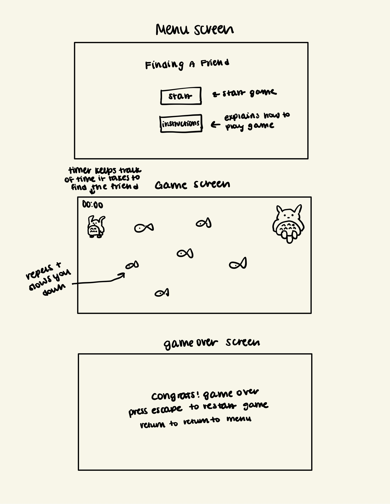
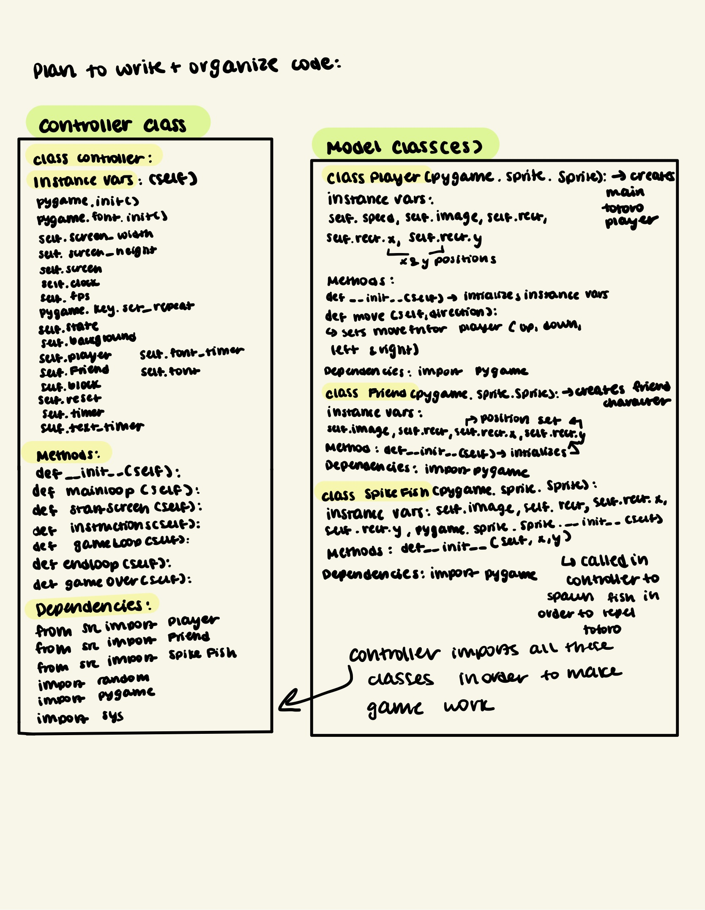

:warning: Everything between << >> needs to be replaced (remove << >> after replacing)
# CS110 Project Proposal
# << Project Title >>
## CS 110 Final Project
### Fall, 2021
### [Assignment Description](https://docs.google.com/document/d/1H4R6yLL7som1lglyXWZ04RvTp_RvRFCCBn6sqv-82ps/edit#)

https://github.com/bucs110a0fall21/final-project-puzzlers

<< [link to demo presentation slides](#) >>

### Team: Puzzlers
#### Christopher Yu, Young Seo (Esther) Hur, Ashley Yu

***

## Project Description *(Software Lead)*
<< Give an overview of your project >>

***    

## User Interface Design *(Front End Specialist)*
* << A wireframe or drawing of the user interface concept along with a short description of the interface. You should have one for each screen in your program. >>
    * For example, if your program has a start screen, game screen, and game over screen, you should include a wireframe / screenshot / drawing of each one and a short description of the components
* << You should also have a screenshot of each screen for your final GUI >>

***        

## Program Design *(Backend Specialist)*
* Non-Standard libraries
    * Additional libraries or modules used: pygame, random, json, sys
    * For each additional module you should include
        * url for the module documentation
        * a short description of the module
* Class Interface Design
    * 
    * This does not need to be overly detailed, but should show how your code fits into the Model/View/Controller paradigm.
* Classes
    * class Player: creates the main character, totoro and sets move functions
    * class Friend: creates the friend character and sets its position on the screen
    * class SpikeFish: creates the spikefish obstacles that will be called in Controller using randomized x and y values for random spawning within a part of the screen

## Project Structure *(Software Lead)*

The Project is broken down into the following file structure:
* main.py
* bin
    * <all of your python files should go here>
* assets
    * <all of your media, i.e. images, font files, etc, should go here)
* etc
    * <This is a catch all folder for things that are not part of your project, but you want to keep with your project. Your demo video should go here.>

***

## Tasks and Responsibilities *(Software Lead)*
* You must outline the team member roles and who was responsible for each class/method, both individual and collaborative.

### Software Lead - Christopher YU

<< Worked as integration specialist by... >>

### Front End Specialist - Ashley Yu

<< Front-end lead conducted significant research on... >>

### Back End Specialist - Young Seo Hur

The back end specialist wrote much of the data classes representing state, location, and behaviour. I drew the sketch of the classes and their purposes and relationships as well as the GUI design plan illustration. Lastly, I was the main debugger as well as functionality improver as I added and improved code to run the characters' movements, start menu, gameover screen, and buttons more smoother and accurately. 

## Testing *(Software Lead)*
* << Describe your testing strategy for your project. >>
    * << Example >>

* Your ATP

| Step                  | Procedure     | Expected Results  | Pass/Comments |
| ----------------------|:-------------:| -----------------:| -------------- |
|  1  | Run main()  | Game starts and loads user into the menu  |   |
|  2  | User clicks Instructions button |  Instructions tab opens and says how to play game | |
|  3  | User clicks "Play"  | 1) Game opens and starts 2) Timer starts | |
|  4  | Press 'esc'  | 1) Player's position is reset 2) Timer is rest |  |
|  4  | Press left arrow  | Player moves left |  |
|  5  | Hold left arrow |  Player continually moves left |  |
|  6  | Press right arrow  | Player moves right |  |
|  7  | Hold right arrow  |  Player continually moves right |  |
|  8  | Press or hold up or down key | Player moves up or down accordingly and keeps going in direction if key held down |   |
|  4  | Player rect touches SpikeFish rect  | Player is repelled away by 2 units |  |
|  9  |  Player rect touches 'Friend' rect | 1) Game ends 2) The highscore and current score are recorded in the json file 3) End Screen pops up with instructions as well as the highscore and current completion time | |
|  10  | User preses "esc" | 1) The game resets 2) The timer resets  | |
|  4  | User presses "return"  | The game returns to the main menu |  |
|  4  | User presses the "close" button on the screen  | The game closes |  |

   

